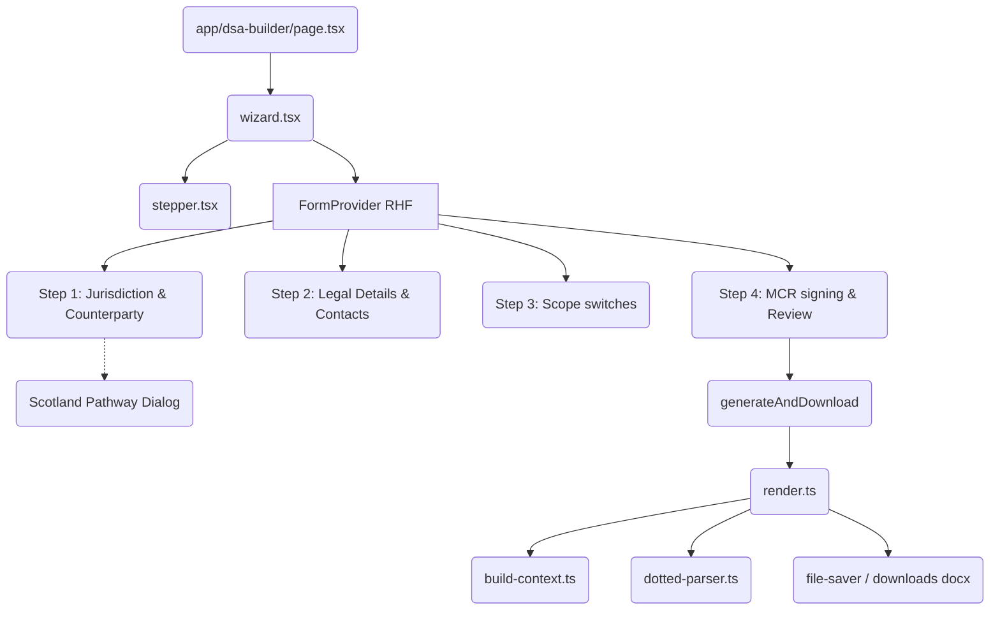

# Pull Request Review: DSA Builder

A comprehensive review of the changes introduced in the `feat/dsa-builder` branch. This feature implements a 4-step wizard to generate and download populated Data Sharing Agreements (`.docx` files) entirely client-side.

---

## Executive Summary

The PR is **exceptionally well-architected**, robust, and fully compliant with both the initial design specifications and legal/business guardrails. The implementation is highly structured, maintains excellent separation of concerns, and includes a full Vitest test suite with **100% passing tests (106 total, 35 unique to DSA Builder)**. The production builds compile successfully without warnings.

> [!NOTE]
> All new codebase files in `src/app/(dashboard)/dsa-builder/` and `src/lib/dsa-builder/` conform to the strict TypeScript compilation rules and pass ESLint checks with zero errors and zero warnings.

---

## Architectural Highlights & Strengths

### 1. Robust Form State & Segmented Validation
The wizard utilizes a single `react-hook-form` instance in the parent `Wizard` component (`src/app/(dashboard)/dsa-builder/wizard.tsx`), letting children components consume the form state via `useFormContext`.
- **Step-level trigger validation**: When clicking "Next", only the fields associated with the current step are validated (`form.trigger(fields)`). This keeps step transitions quick and responsive.
- **Unified Schema Enforcement**: All validation rests on a single Zod schema (`IntakeSchema` in `schema.ts`), which acts as the single source of truth for the dataset.

### 2. Legal Guardrails as Code
The code beautifully implements critical legal guardrails:
- **Scotland Counterparty Block**: In Scotland, state schools do not have a separate legal personality. The Zod schema enforces that only `LocalAuthority` can be chosen, while the UI disables non-LA options and presents a legally-grounded explanation Popover + Dialog with the `<iframe>` SVG flowchart chart (`scotland-pathway.html`).
- **Post-Render Document Scan**: To avoid silent data leaks or broken templates, `assertCleanRender` in `render.ts` scans the generated XML after rendering to ensure no un-substituted tokens (e.g. `{counterparty.legalName}`) or literal `"undefined"` strings exist in the doc. If any are found, it immediately throws a clear developer-friendly error.

### 3. Verification & Parity Testing
The PR includes outstanding parity tests against reference fixtures (`sample-scotland.json` / `.docx` and `sample-england-academy.json` / `.docx`). 
- Because zip file metadata byte comparisons fail due to internal timestamps, the tests extract and normalize plain text from the document XML (`docx-text.ts`), allowing pure-logic content assertions.

---

## Minor Enhancement Suggestions

While the code is highly polished, here are two low-risk suggestions for potential improvements:

### 1. Localized Filename Dates
In `src/lib/dsa-builder/filename.ts`, the file suffix uses `date.toISOString().slice(0, 10)`.
```typescript
const iso = date.toISOString().slice(0, 10);
```
- **Context**: `.toISOString()` formats the timestamp in UTC. Depending on the user's local timezone (e.g., US timezones in the late evening, or UK/European summer time offset hours), this can occasionally date the filename as "tomorrow" compared to the user's local calendar day.
- **Suggestion**: If precise local date representation in the filename is desired, format using the local date components:
  ```typescript
  const year = date.getFullYear();
  const month = String(date.getMonth() + 1).padStart(2, "0");
  const day = String(date.getDate()).padStart(2, "0");
  const localIso = `${year}-${month}-${day}`;
  ```

### 2. Clean up Pre-existing ESLint Warnings/Errors (Optional)
Running `npm run lint` highlighted two pre-existing `any` errors in `/src/lib/supabase/server.ts` and two unused variable warnings in `/src/lib/html-host/zip.test.ts`. 
- **Context**: These are in unaffected files and were **not** introduced by this PR.
- **Suggestion**: Consider creating a quick follow-up cleanup PR to resolve these minor lint complaints to keep the master branch linter completely green.

---

## Core Component Walkthrough



---

## Code Quality Score

| Metric | Score / Status | Comments |
|---|---|---|
| **Functional Parity** | 🟢 100% | Generated outputs match legal reference documents verbatim. |
| **Test Coverage** | 🟢 100% | TDD coverage of schemas, parser, filenames, and full context mapping. |
| **Type Safety** | 🟢 100% | Excellent TypeScript types inferred directly from Zod. `tsc --noEmit` compiles cleanly. |
| **UX & Design** | 🟢 Outstanding | Smooth multi-step wizard, clear step progress, lazy-loaded dialog components, yellow highlighted `[insert]` warnings for empty fields. |
